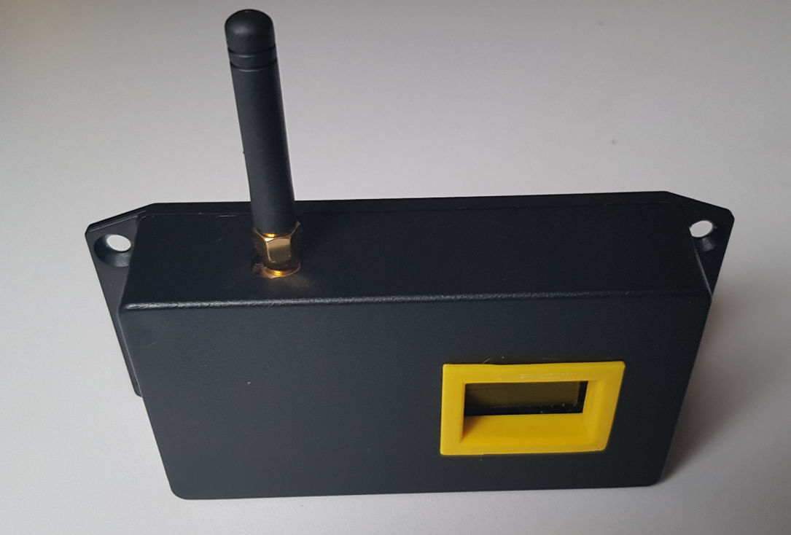

# TTN-Apeldoorn P1-Node
This is the P1-Node of TTN-Apeldoorn. The P1-Node is a LoRaWAN device that will read the information form intelligent energy meters (Intelligente meters) the have a P1-interface. 

# License
The TTN-Apeldoorn P1-Node node is free soft- and hardware:
you can redistribute and/or modify it under the terms of a Creative Commons Attribution-NonCommercial 4.0 International License (http://creativecommons.org/licenses/by-nc/4.0/) by TTN-Apeldoorn (https://www.thethingsnetwork.org/community/apeldoorn/) E-mail: ttnapeldoorncoreteam@rfsee.nl

 This work is licensed under a <a rel="license" href="http://creativecommons.org/licenses/by-nc/4.0/">Creative Commons Attribution-NonCommercial 4.0 International License</a>.