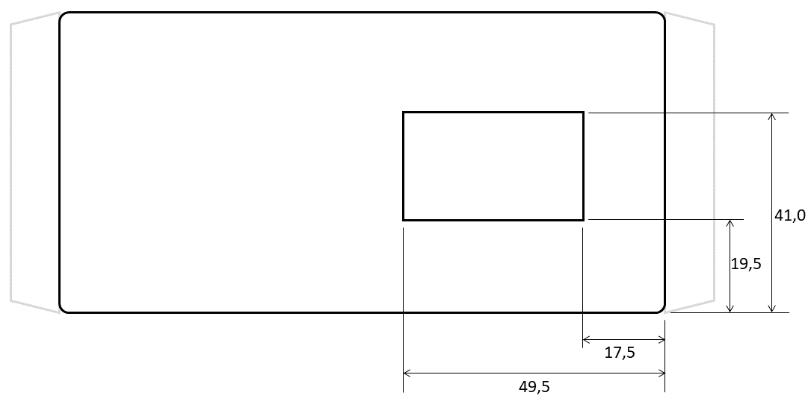
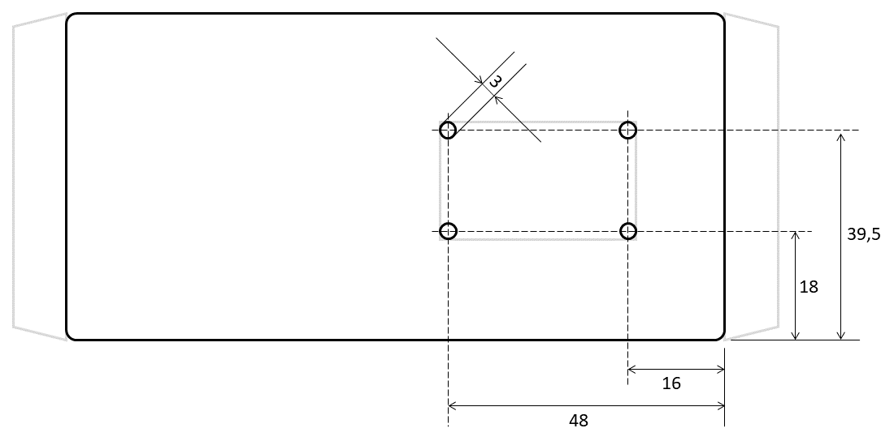

# P1-LoRaWAN sensor Housing
The P1-Sensor is constructed for a Hammond 1591XXBSFL Enclosure. This enclosure is a black RAL 7011 Flanged enclosure with the dimensions 113.82 x 63.32 x 28.25 mm.
The PCB, that is screwed using parkers, to the flanged lid of the box, is holding all components and connectors together so that only holes shall be made in the box at the required positions.
As the TTGO LORA32 has an Oled display the box shall be given a window so that the information on the display can be read. Because manually created holes in PVC or ABS are difficult to make with smooth and straight edges, a 3D-printed PLA frame is used as a cover around the window trough wchich the display can be viewed.
This document will describe all measures for aproperiate holes in the flanged Hammond box and the files for the 3D printed frame.

## Dimensions of holes

### Bottom side

### Top side

### Right side

### Front side

Blah blah

Blah blah

Explanantion

## 3D printed frame

