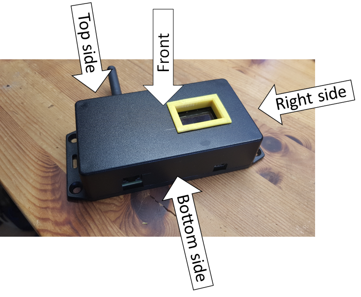
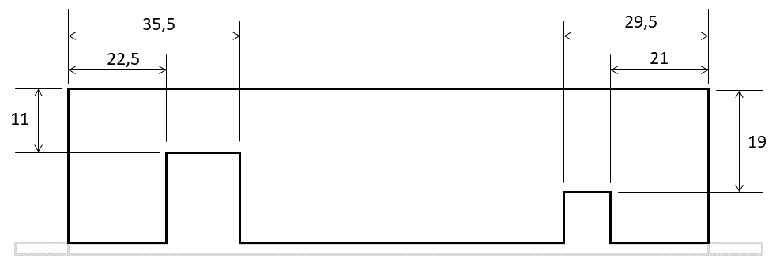
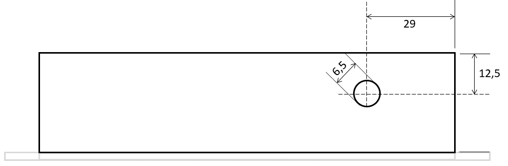
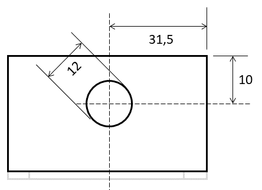

# P1-LoRaWAN sensor Housing
The P1-Sensor is constructed for a Hammond 1591XXBSFL Enclosure. This enclosure is a black RAL 7011 Flanged enclosure with the dimensions 113.82 x 63.32 x 28.25 mm. The PCB, that is screwed using parkers, to the flanged lid of the box, is holding all components and connectors together so that only holes shall be made in the box at the required positions.

As the TTGO LORA32 has an Oled display the box a window so that the information on the display can be read. Because manually created holes in PVC or ABS are difficult to make with smooth and straight edges, a 3D-printed PLA frame is used as a cover around the window trough wchich the display can be viewed.

This document will describe all measures for aproperiate holes in the flanged Hammond box and the files for the 3D printed frame.

## Dimensions of holes
This paragraph will present schematics of all dimensions and measures of the holes that shall be applied to the Hammond box.

For orienteering purposes the following image shows which sides are documented and how they are named in thif description.

### Bottom side
On the bottom side connectors are situated for the serial connection to the P1-interface (left) using a RJ12 connectort and a mini-USB connector for a small 5V power supply. 

### Top side
At the top side a hole is located to allow access to the SMA antenna connector. 

### Right side [optional]
At the right side a hole to access micro-USB connector of the TTGO LORA32 board may be added. This hole is optional.

### Front side
At the front of the box the display is located of the TTGO LoRa32 board. This rectangular shaped window will be used in combination with a 3D printed frame. The 3D printed frame can be downloaded below. 

To aid the creation of the window the following holes can be drilled:

## 3D printed frame
The 3D printed frame is made available as Sketchup source file and STL-file for download. 

 - Sketchup source file: <a download="Venster_003.skp" href="Venster_003.skp" title="Sketchup file, right-click and download.">Venster_003.skp</a>
 - STL-file: <a download="Venster_003_fixed.stl" href="Venster_003_fixed.stl" title="STL-file">Venster_003_fixed.stl</a>

#License